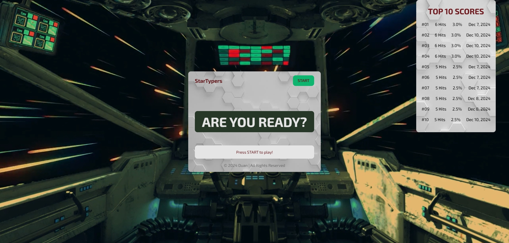
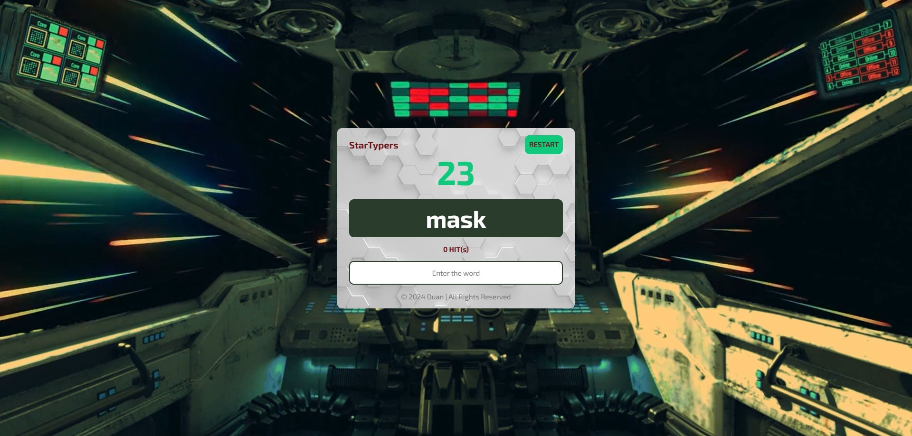

# StarTyper

**Welcome aboard _StarTyper_ — the ultimate space-themed typing challenge!**

Strap into your seat inside a futuristic spaceship cockpit, where words become your mission targets and **time is your greatest rival**. As the engines hum and stars streak past your view, you're tasked with one job:  
**Type fast. Type accurately. Conquer the void.**

---

## How to Play

1. Click the **START** button to initiate your mission.
2. Words will appear on your spaceship's display screen.
3. The countdown timer will start ticking.
4. Type each word **exactly as shown** into the input field.
5. When a word is entered correctly, it will be replaced with a new one.
6. Continue typing as many correct words as possible **within the time limit**.

---

## Goal

Type quickly and accurately to **maximize your score** before time runs out.  
The game ends when the timer reaches zero or when all words are completed.

---

## After the Game

- Your **score** will be displayed.
- A leaderboard will show the **Top 10 all-time scores**.

Can you become the fastest pilot in the StarTyper fleet?

---

## Features

- Immersive **spaceship-themed interface**
- Fast-paced **typing gameplay**
- Real-time **timer-based challenge**
- Focus on **accuracy and speed**
- Automatic **Top 10 history tracking**

---

Get ready to type among the stars.  
**Let the mission begin!**

---

## Game Interface

---

## The technologies used to build the web app
- <h3>Front-end</h3>
  - HTML (HyperText Markup Language)
   
  - CSS (Cascading Style Sheets)
   
  - JavaScript
- <h3>Version Control</h3>
  - GitHub
- <h3>Hosting and Deployment</h3>
  - Netlify